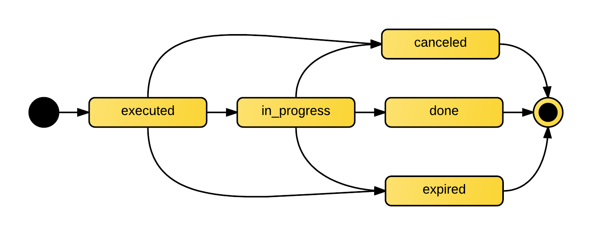

.. _simple/orders:

================
Работа с заказом
================

Жизненный цикл
==============

.. _simple/orders/diagram:

Диаграмма состояний (статусов) заказа
-------------------------------------

.. _executed:

executed
--------

Заказ всегда создаётся в статусе ``executed``.
Через 10 минут, заказ в этом состоянии переходит в :ref:`expired`.

С заказом в состоянии ``executed`` возможны следующие :ref:`действия <simple/orders/actions>`:

    * :ref:`забронировать билеты <simple/orders/reserve>`;
    * :ref:`добавить информацию о покупателе <simple/orders/customer>`;
    * :ref:`выбрать платёжную систему <simple/orders/ps>`;
    * :ref:`отменить <simple/orders/cancel>`;
    * :ref:`перевести в соятояние <simple/orders/change_status>` :ref:`in_progress`;

.. _in_progress:

in_progress
-----------

Это соcтояние ожидания подтверждения оплаты.
Время бронирования увеличивается с учётом
:ref:`выбраной <simple/orders/ps>` :term:`платёжной системы <платёжная система>`.

Возможные :ref:`действия <simple/orders/actions>`:
    * :ref:`убрать часть билетов из заказа <simple/orders/partial>`;
    * :ref:`отменить <simple/orders/cancel>`;
    * :ref:`перевести в состояние <simple/orders/change_status>` :ref:`done`;

.. _done:

done
----

Заказ в этом статусе уже оплачен.
Инициатор перехода в этот статус зависит от
:ref:`выбраной <simple/orders/ps>` :term:`платёжной системы <платёжная система>`.

.. _canceled:

canceled
--------

Заказ отенён. Ничего сделать с ним нельзя.

.. _expired:

expired
-------

Заказ просрочен, забронированные билеты снова вернулись в продажу.

.. _simple/orders/actions:

Действия
========

Все действия с заказом, кроме его создания, делаются по запросу
``PATCH /v1/resources/orders/:id``.
В один запрос одновременно может быть добавленно нескольно действий.

Все запросы на изменение конкретного заказа, должны делаться синхронно.
В случае получения запроса до конца обработки предыдущего, будет возвращена ошибка ``409 Conflict``.
Это ограничение касается только работы с одним заказом, а работать одновременно с несколькими заказами можно.

.. _simple/orders/create:

Создание
--------

Заказ создаётся запросом ``POST /v1/resources/orders``.
Возможно добавление всех действий, в статусе :ref:`executed`.

.. _simple/orders/reserve:

Бронирование билетов
--------------------

За бронирование билетов отвещают три поля:
    * :ref:`tickets <simple/orders/reserve/tickets>`
    * :ref:`random <simple/orders/reserve/random>`
    * :ref:`all_or_nothing <simple/orders/all_or_nothing>`

.. _simple/orders/reserve/tickets:

Поле ``tickets``
~~~~~~~~~~~~~~~~

В поле ``tickets`` передаются все id :term:`билетов <билет>`, которые должны быть
забронированны текущим :term:`заказом <заказ>`.
Если заказ изменяется (покупатель решил добавить ещё один билет), то в обязательно порядке
передаются *все* билеты, которые должны быть в заказе (в т.ч. те, что уже забронированны).
Для удаления конкретного билета из заказа, нужно передать все билеты, кроме удаляемого.

Нельзя использовать в одном запросе с ``random``.

* :ref:`Пример запросов <ex/orders/tickets>`.

.. _simple/orders/reserve/random:

Поле ``random``
~~~~~~~~~~~~~~~

Поле ``random`` предназначено для бронирования случайных билетов из указанных
:term:`категорий <билетная категория>`. Оно нужно для того, чтобы добавлять в заказ
билеты без мест.
Имеет вид объекта, где ключ является id категории, а значение — количество билетов.

Так же, как и в ``tickets``, всегда нужно передавать желаемое состояние.
Т.е. если пользователь удалил один билет из категории, то передать надо ``random``
со всеми категориями и количествами, только в одной из категорий будет на один билет меньше.

В ответе от сервера всегда будет список забронированных билетов в поле ``tickets``.

Нельзя использовать в одном запросе с ``tickets``.

* :ref:`Пример запросов <ex/orders/random>`.

.. _simple/orders/all_or_nothing:

Поле ``all_or_nothing``
~~~~~~~~~~~~~~~~~~~~~~~

Если поле ``all_or_nothing`` ``true``, то бронируются либо все билеты, либо ни одного.
При изменении заказа с одновременным разбронированием и бронированием билетов,
в случае неудачи с бронированием хотя бы одного билета, разбронирования не происходит,
т.е. список забронированных билетов не изменяется.

Если значение не указано, или ``false``, то билеты, которые не удалось забронировать
пропускаются и отсутствуют поле ``tickets`` в ответе.

Можно использовать, как с ``tickets``, так и с ``random``.

* :ref:`Пример запросов <ex/orders/all_or_nothing>`.

.. _simple/orders/customer:

Добавление информации о покупателе
----------------------------------

Информация о покупателе содержится в поле ``customer``. В ней есть следующие поля:

:email: email пользователя
:first_name: имя
:last_name: фамилия
:mobile: телефон

В зависимости от
:ref:`выбраной <simple/orders/ps>` :term:`платёжной системой <платёжная система>`,
некоторых из этих полей могут быть обязательными для завершения заказа.

.. _simple/orders/ps:

Выбор платёжной системы
-----------------------

:term:`Платёжные системы <платёжная система>` настраиваются в поле ``payment`` со следующими подполями:

:system: тип платёжной системы, передаётся либо id, либо строкой из :ref:`списка <simple/ps>`;
:send_tickets: отсылать ли письмо о покупке
    (если не установлено, зависит от :term:`платёжной системы <платёжная система>`);

* :ref:`Пример работы с заказом <ex/orders/manual>`

.. _simple/orders/change_status:

Смена статуса
-------------

Смена статуса (состояния заказа) осуществляется путём установки поля ``status``.
При попытке перевести заказ в состояние, не соответствующее :ref:`диаграмме состояний <simple/orders/diagram>`,
сервер вернёт ответ с кодом ``400 Bad Request``.

Нельзя вручную перевести заказ в статус :ref:`expired`.
Возможность перехода из :ref:`in_progress` в :ref:`done` определяется
:ref:`выбраной <simple/orders/ps>` :term:`платёжной системой <платёжная система>`
и может быть ограничена.

* :ref:`Пример запросов <ex/orders/carry_out>`.

.. _simple/orders/cancel:

Отмена
------

Отмена заказа, это :ref:`установка статуса <simple/orders/change_status>` :ref:`canceled`.
Очень важно отменять заказ, как только это возможно, чтобы билеты вернулись в продаже.

* :ref:`Пример запросов <ex/orders/cancel>`.

.. _simple/orders/partial:

Частичная оплата
----------------

В статусе заказа :ref:`in_progress`, можно часть билетов убрать из заказа.
Например, если пользователь оплатил только часть билетов.

Для разбронирования, нужно сделать запрос с :ref:`полем tickets <simple/orders/reserve/tickets>`
с оставшимися билетами.

.. EXAMPLE
.. Не факт, что работает. Надо тестировать.
