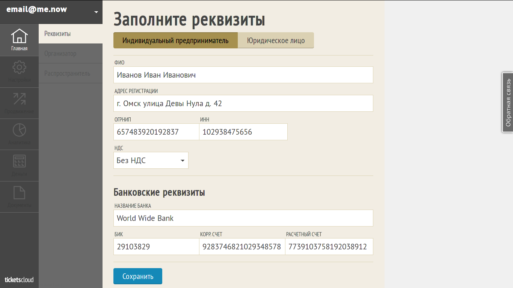
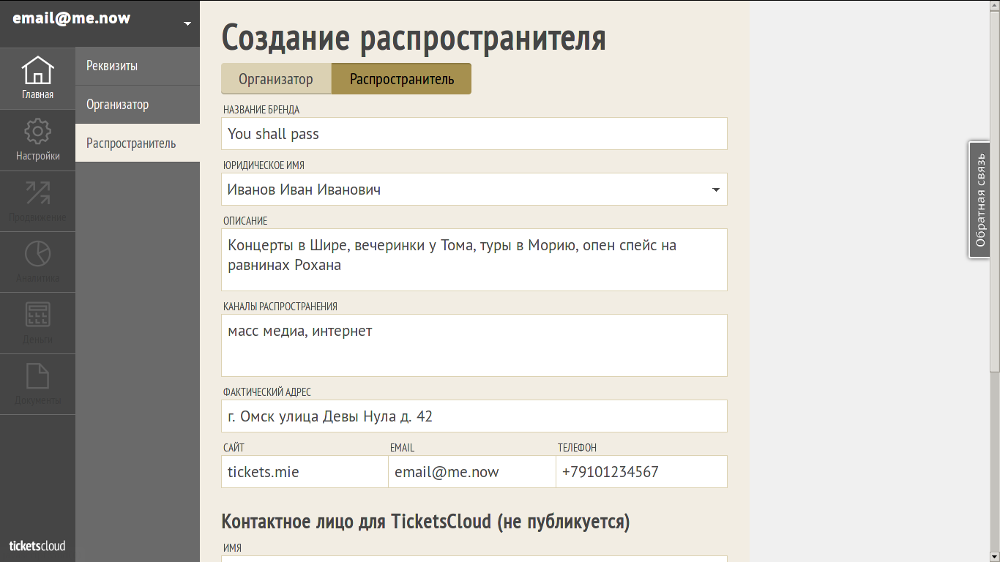
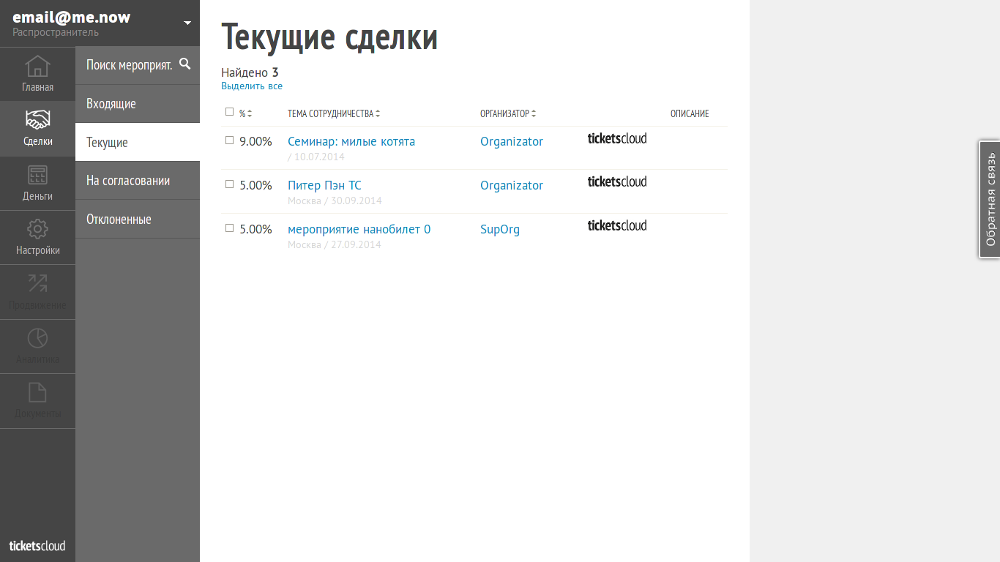
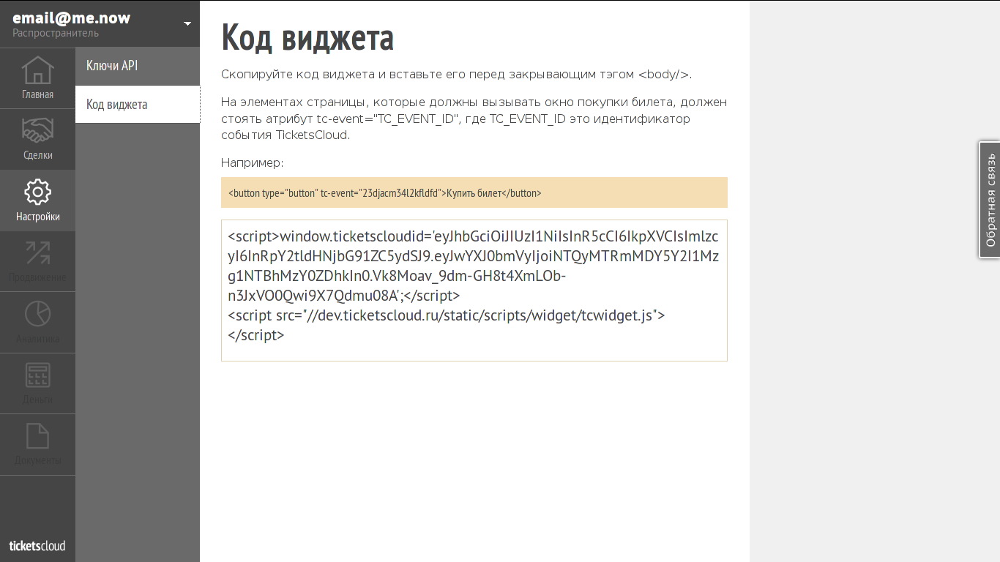

==================
Simple integration
==================

Register on TicketsCloud
========================

First of all, you should register yourself on https://ticketscloud.org

.. image:: integration-easy-0.png

Provide Base Information About Your Company
===========================================

On the next step you need to provide base information about your company to
let us know a little bit more about with whom we're working on. This information
is used to make assignments between your company and TicketsCloud.

Create New Distributor
======================

Next step would be creation of own distributor.

Make a Deals
============

Now it's time to make a deals! Deals are special business object which allows
Distributor to sell tickets on events provided by Organizers.

Get Your Widget
===============

Navigate to "Options" menu, pick the widget code and insert it into your
website source code. Make sure you followed other instructions on the page.

