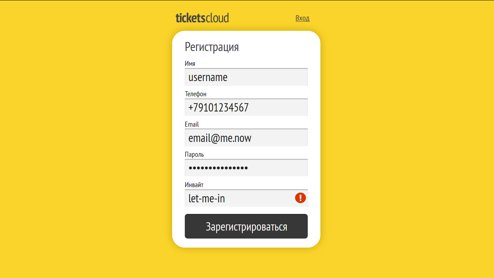
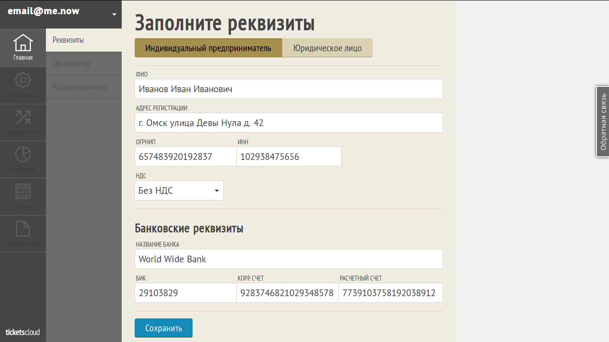
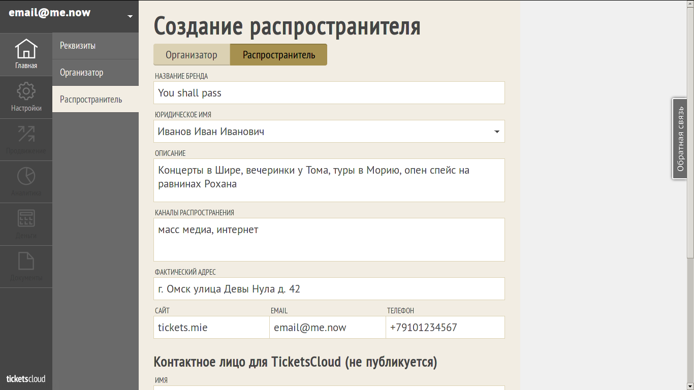
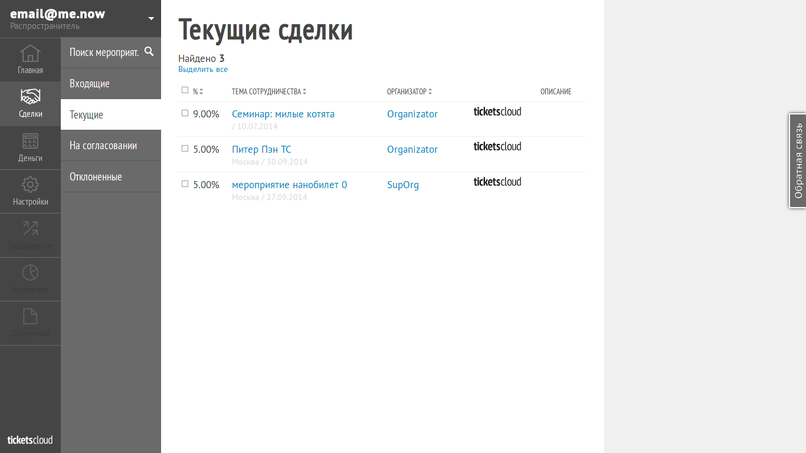
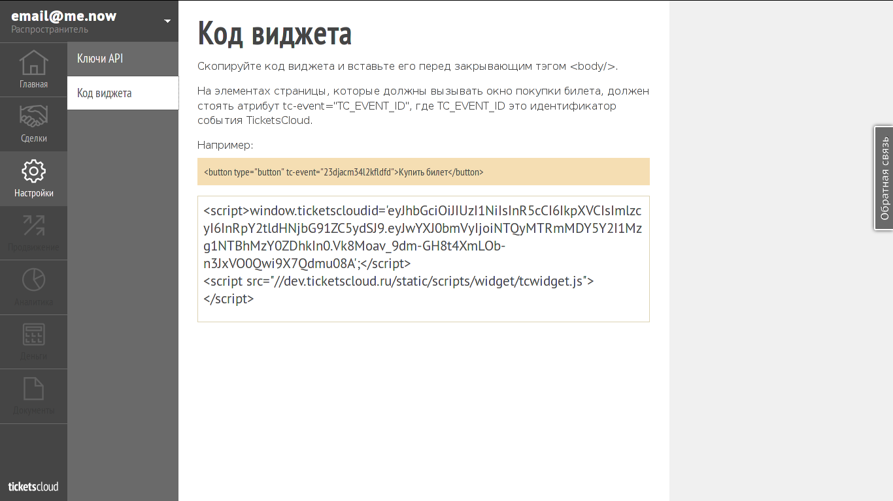

==================
Simple integration
==================

.. note:: If you're developer jump to :ref:`widget`.

Register on TicketsCloud
========================

First of all, you should register yourself on https://ticketscloud.org

Provide Base Information About Your Company
===========================================

On the next step you need to provide base information about your company to
let us know a little bit more about with whom we're working on. This information
is used to make assignments between your company and TicketsCloud.

Create New Distributor
======================

Next step would be creation of own distributor.

Make a Deals
============

Now it's time to make a deals! Deals are special business object which allows
Distributor to sell tickets on events provided by Organizers.

.. _widget:

Get Your Widget
===============

Navigate to "Options" menu, pick the widget code and insert it into your
website source code. Make sure you followed other instructions on the page.

Bind Your Events With TicketsCloud
==================================

To let your widget work, you should pass :ref:`event` ID to it as query
parameter. However, this ID should be native for TicketCloud and unlikely will
be familiar for your system. To fix this moment you should create binding
mapping between your event IDs and TicketsCloud ones. To simplify the process
see :ref:`simpleevents` page.
